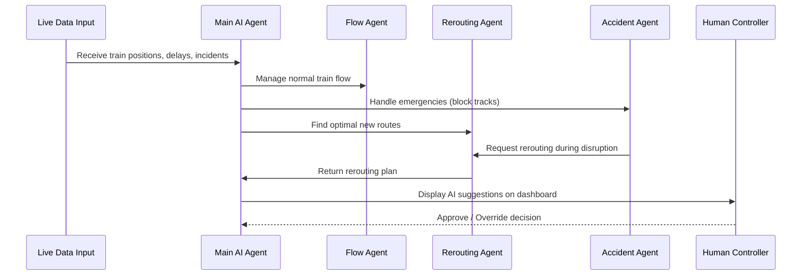

# 🚆 AI Co-Pilot for Indian Railways

> **Smart India Hackathon 2025 – Team Falcon**  
> Problem Statement ID: **SIH25022** | Theme: **Transportation & Logistics** | Category: **Software**

  
  
  
  


---

## 🌍 Vision

Our solution is an **AI-powered Decision Support System** designed for the unique challenges of **Indian Railways**.  
It acts as an **intelligent co-pilot for traffic controllers**, upgrading the manual system into a modern, proactive one.

👉 The goal is **not to replace** the invaluable experience of controllers, but to **empower them** with a tool that handles the complexity of the network—making operations **safer, more efficient, and easier to manage**.

---

## 🤖 Our Solution: A Practical, Agent-Based AI

Unlike typical ML or RL models, our system is:

- ✅ **No Training, No Guesswork** → Works from day one.  
- ⚡ **Ultra-Low Latency** → Real-time decision making.  
- 🧠 **Rules + Logic Driven** → Built on Indian Railways regulations.

### 👥 AI Agents

- **Main AI Agent (Chief Controller)** → Delegates and supervises.  
- **Regular Flow Agent** → Manages day-to-day operations.  
- **Train Rerouting Agent** → Strategically reroutes trains to minimize delays.  
- **Accident Handling Agent** → First responder in emergencies.  
- **Priority Management System** → Weighted delays (e.g., *1 hr Rajdhani delay = 5 hr effective delay*).

---

## ⚡ Handling Railway Complexity

- 🚨 **Accidents & Emergencies** → Instantly blocks affected tracks & reroutes trains.  
- 🔀 **Intelligent Rerouting** → Maximizes available track usage while minimizing delays.  
- 🎯 **Priority Management** → Ensures high-priority trains always get preference.

---

## 📊 Controller Dashboard

- 🗺️ **Live Simulation** of train movements.  
- 🚦 **Emergency Highlighting** → Blocked tracks in red.  
- 🎛️ **Manual Handover** → Controller always retains full command.

---

## 🏗️ System Architecture

- Part 1:
```mermaid
flowchart TD
    subgraph DataLayer[Data Layer]
        Sensors[Train Sensors & Track Signals]
        API[Indian Railways APIs]
    end

    subgraph Backend[Backend - AI System]
        MainAgent[Main AI Agent (Chief Controller)]
        FlowAgent[Regular Flow Agent]
        RerouteAgent[Train Rerouting Agent]
        AccidentAgent[Accident Handling Agent]
        DB[(PostgreSQL Database)]
    end

    subgraph Frontend[Frontend - Controller Dashboard]
        Dashboard[Next.js Live Dashboard]
        Simulation[Real-time Train Simulation]
    end

    Sensors -->|Live Data| API --> MainAgent
    MainAgent --> FlowAgent
    MainAgent --> RerouteAgent
    MainAgent --> AccidentAgent
    FlowAgent --> DB
    RerouteAgent --> DB
    AccidentAgent --> DB
    MainAgent --> Dashboard
    Dashboard --> Simulation
    Dashboard -->|Manual Override| MainAgent
```
-Part 2:

